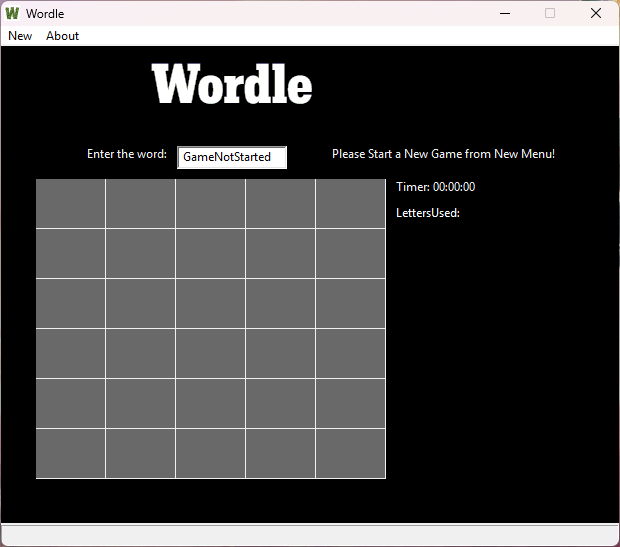
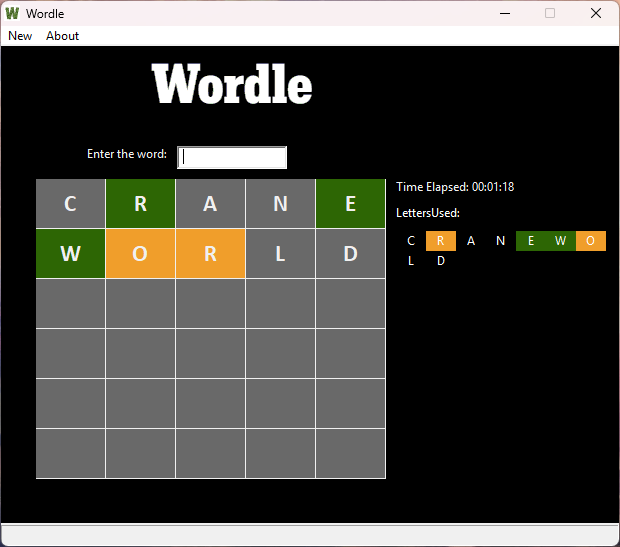
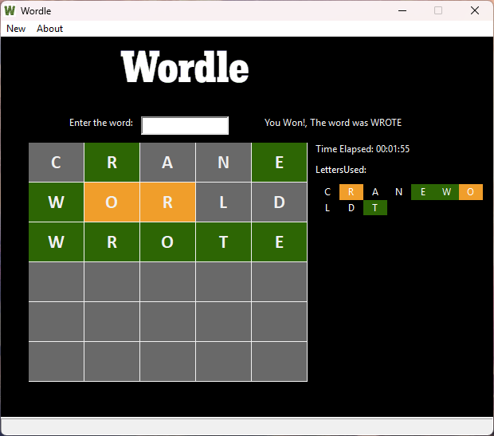

## Binaries
Windows: [Wordle v1.1](https://github.com/AC17dollars/cpp-wordle-clone/releases/tag/v1.1)

## Compilation

### Dependencies

+wxWidgets v3.0 or above

```
g++ ./src/*.cpp ./icon.res -o ./build/release/Wordle.exe -I ./include -I path/to/wxWidgets/315/include -I path/to/wxWidgets/315/lib/gcc_dll/mswu -L path/to/wxWidgets/315/lib/gcc_dll -l wxmsw31u_core -l wxbase31u -mwindows
```


### Game Screenshot 1


### Game Screenshot 2


### Game Screenshot 3

